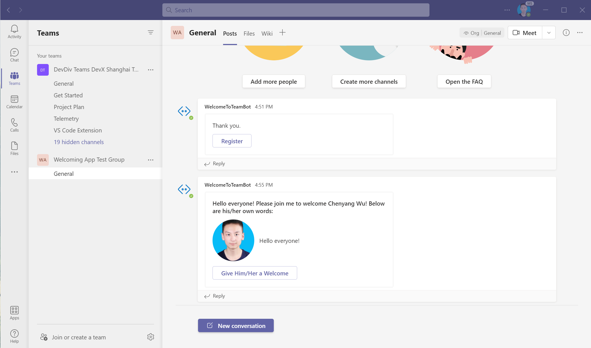

### WelcomeToTeam

#### How to Use

The newcomer does **NOT** need to do the procedures below, which are relatively complicated. Only the one who knows how to use Microsoft Teams and wants to equip his/her team with this app needs to do the following. **Newcomers are NOT expected to know anything to use the app.** This app is completely **newcomer-friendly**.

##### 0. Configure SSO for bot

This step is **necessary** because SSO for bot is only possible for those who have already installed this app as a **personal** app.

In the "**Apps**" menu, click "**Upload a custom app**":

Select the `.zip` file contained in the repository.

Add the app.

After adding the app, text the bot "**SSO**".

Then allow the app to sign in on behalf of you. If you receive a bot message "**SSO is configured.**", it means that this step is successful.

##### 1. Upload It to Your Team

In the team's menu, click the item "**Manage team**".

Go to the page "**Apps**", click the link "**Upload a custom app**" in the lower right corner of the page.

Select the `.zip` package contained in the repository.

Add the app. It may take a while for this procedure to complete.

The app is then added to your team.

##### 2. Register Yourself in App (If You are Already in the Team Before the App Is Installed)

As a team member who is already in the team, you need to manually register yourself in the app. Click the button "**Register**".

You are then registered.

#### What the Newcomer Sees

##### 1. The Newcomer Joins the Team

##### 2. The Newcomer Receives Messages from App

The newcomer receives a message that wants him/her fill in a self-introduction.

When he/she submits it, the self-introduction will be sent to the team.

Now the self-introduction is available in the default channel of his/her team.

#### What a Regular Team Member Sees

A team member can enter some welcoming words by clicking the button on the card.

After submitting, the welcoming words can be seen by all members.

#### Additional Features

##### Tab That Contains Self-Introduction Written by the Viewers' Teammates

##### Configurable To-Do List That Is Specific to a Certain Team

Moreover, the to-do list can be configured by uploading a `JSON` file. You can follow the example `JSON` file to create your own to-do list.

